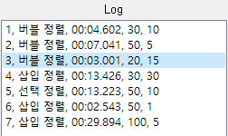
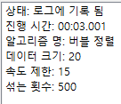
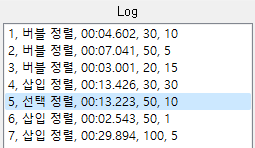
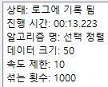
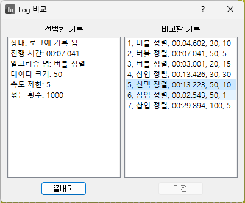
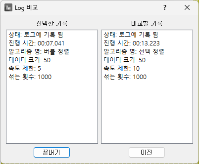
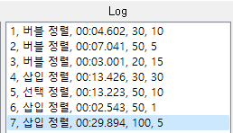
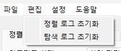
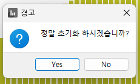
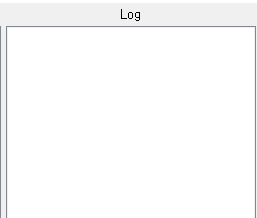

# 정렬/탐색 알고리즘 시각화 - 7주차

컴퓨터공학전공 2020215730 조대영

---

<!-- _header: 목차-->

# 목차

* ### 개발 진척사항

* ### 논문 진척사항

---

<!-- _header: 개발 진척사항-->

# 개발 진척사항

## 추가 사항

* 알고리즘 추가

* 로그창 아이템 클릭 시 상태창에 반영

* 로그창 아이템 더블 클릭 시 다른 기록과 비교 기능 추가

* 로그 초기화 기능 추가

* 그래프 초당 프레임(fps) 설정 가능

* 전체화면 설정 가능

---

<!-- _header: 개발 진척사항-->

## 알고리즘 추가

---

<!-- _header: 개발 진척사항-->

## 로그창 아이템 클릭 시 상태창에 반영

    
    
    

    
    
    

---

<!-- _header: 개발 진척사항-->

<video muted controls width="70%">
    <source src="./images/log_c.mp4" type="video/mp4"/>
</video>

---

<!-- _header: 개발 진척사항-->

## 로그창 아이템 더블 클릭 시 다른 기록과 비교 기능 추가

    
    
    
    
    

---

<!-- _header: 개발 진척사항-->

<video muted controls width="70%">
    <source src="./images/log_dc.mp4" type="video/mp4"/>
</video>

---

<!-- _header: 개발 진척사항-->

## 로그 초기화 기능 추가

    
    
    
    
    
    
    

 
* 정렬 테이블, 탐색 테이블 각각 초기화 가능

---

<!-- _header: 개발 진척사항-->

## 그래프 초당 프레임(fps) 설정 가능

<video muted controls width="70%">
    <source src="./images/frame.mp4" type="video/mp4"/>
</video>

---

<!-- _header: 개발 진척사항-->

## 전체화면 설정 가능

<video muted controls width="70%">
  <source src="./images/fullscreen.mp4" type="video/mp4"/>
</video>

다음번 사용시에도 그대로 적용

---

<!-- _header: 논문 진척사항-->

## 
---

# 감사합니다.