# 정렬/탐색 알고리즘 시각화 - 7주차

컴퓨터공학전공 2020215730 조대영

---

<!-- _header: 목차-->

# 목차

* ### 개발 진척사항

* ### 논문 진척사항

* ### 셀프 평가 및 향후 계획

---

<!-- _header: 개발 진척사항-->

# 개발 진척사항

* PyQt5 라이브러리에서 PyQt6 라이브러리로 변경

* **알고리즘 추가:** 병합 정렬, 퀵 정렬, 힙 정렬

* 메뉴바(menubar)에서 소스코드 보기 기능 추가

* 상태바(statusbar)에서 상태 표시

---

<!-- _header: 개발 진척사항-->

## PyQt5 라이브러리에서 PyQt6 라이브러리로 변경

<p align="center">
    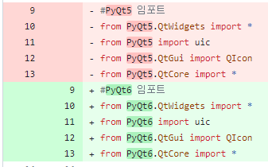
    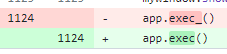
</p>

```
PyQt5의 최신 라이브러리인 PyQt6으로 변경
라이브러리 변경에 따라 문제를 일으키는 코드 변경 및 논문에서 관련 내용 수정
```

---

<!-- _header: 개발 진척사항-->

## 알고리즘 추가

<p align="center">
    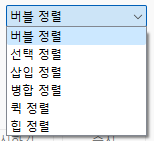
</p>

---

<!-- _header: 개발 진척사항-->

<p align="center">
    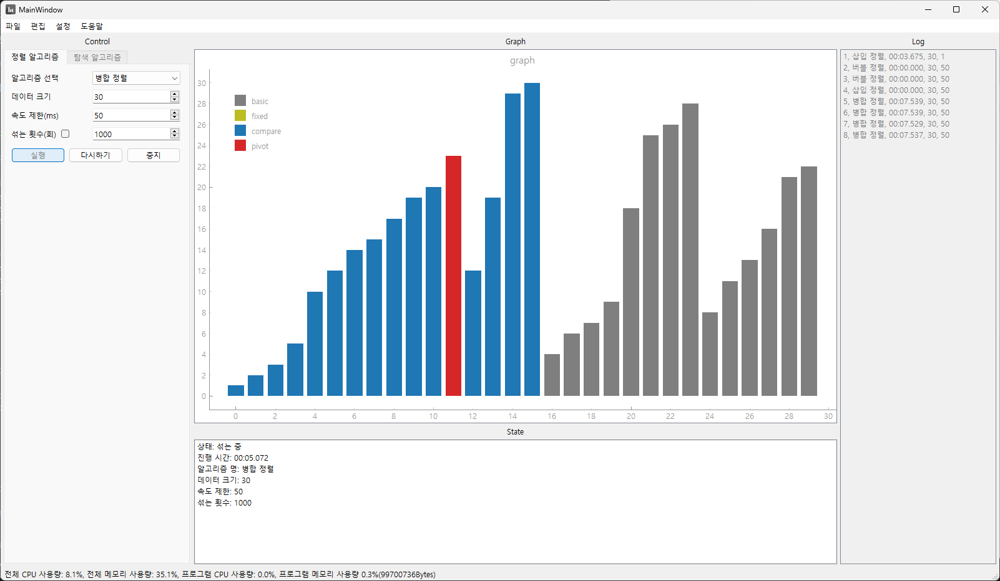
    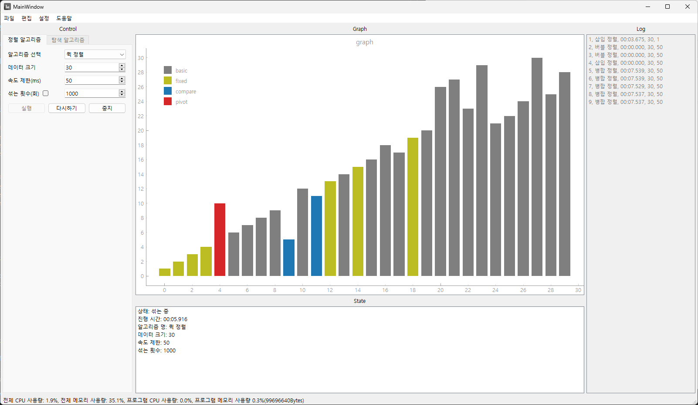
    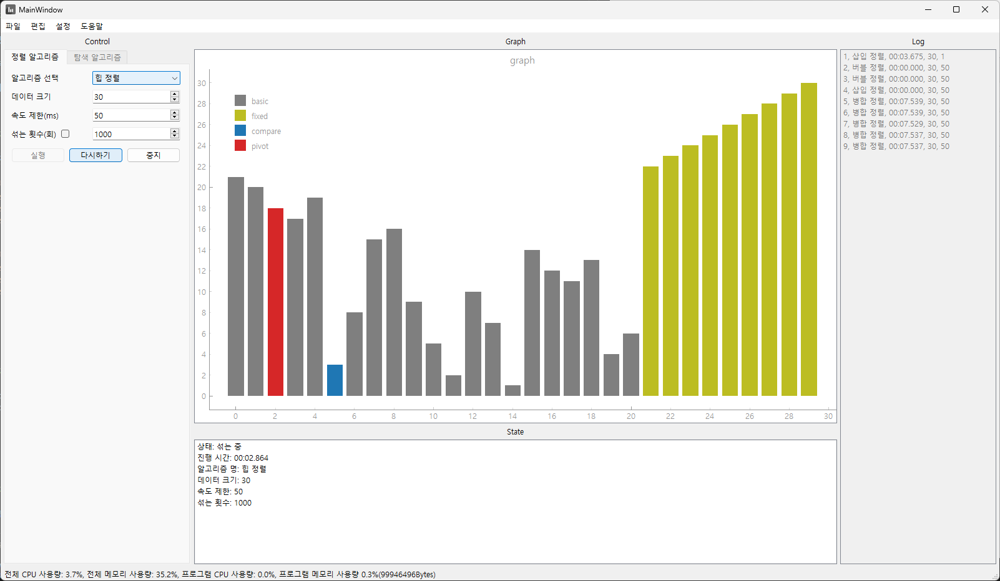
</p>

```
차례대로 병합 정렬, 퀵 정렬, 힙 정렬
-> 재귀구조로 이식, 단, 제자리 정렬
```

---

<!-- _header: 개발 진척사항-->

## 소스코드 보기 추가

<p align="center">
    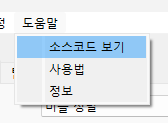
</p>

---

<!-- _header: 개발 진척사항-->

<p align="center">
    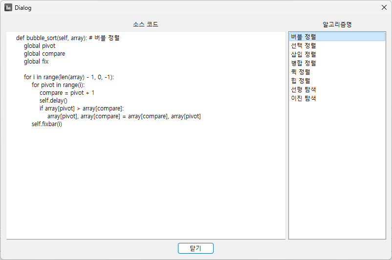
    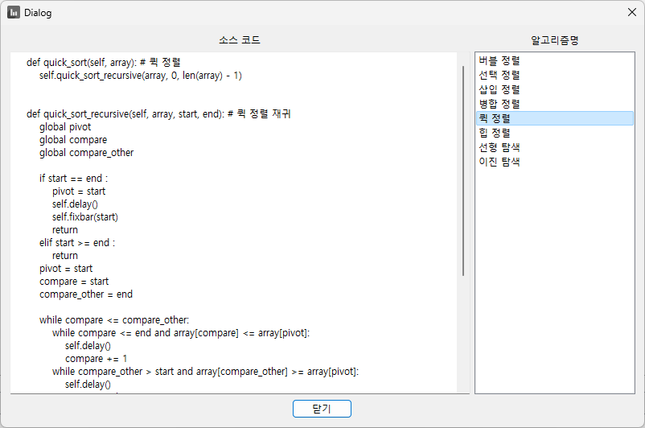
</p>

```
inspect 라이브러리의 getsource() 함수 활용
  -> 파이썬의 함수 또는 클래스, 모듈(.py 파일)의 소스코드를 문자열로 반환하는 함수
```

---

<!-- _header: 개발 진척사항-->

## 상태바(statusbar)에서 상태 표시

<p align="center">
    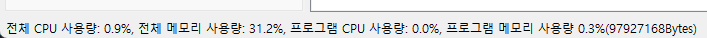
</p>

```
하단 상태바에서 CPU 및 메모리 사용량 실시간 표시
```

---

<!-- _header: 논문 진척사항-->

# 논문 진척사항

* [4.2. 프로그램 구현]에 추가된 UI에 대한 내용 기술

* [4.2. 프로그램 구현]에 소스 코드에 대한 내용 및 캡쳐 이미지 추가

* [5. 실험 및 결과 분석]에 추가된 사항에 대한 내용 기술

---

<!-- _header: 논문 진척사항-->

## [4.2. 프로그램 구현]에 추가된 UI에 대한 내용 기술

<p align="center">
    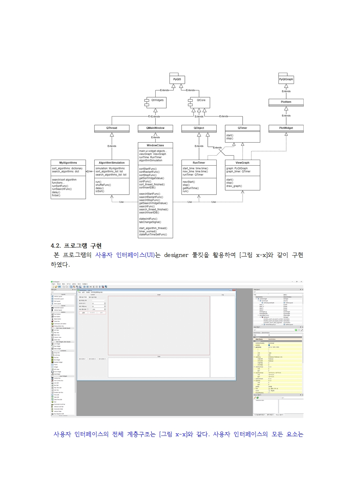
    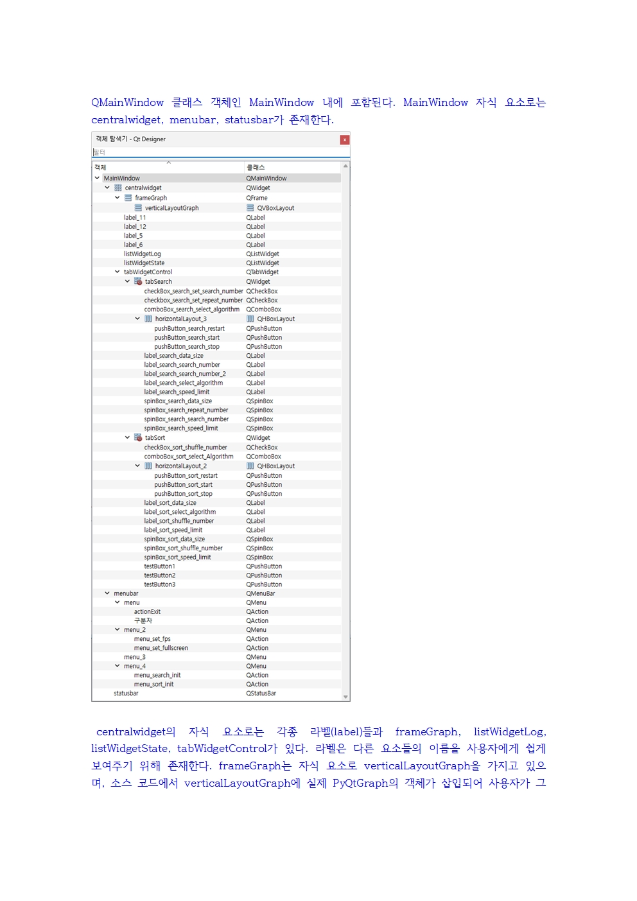
    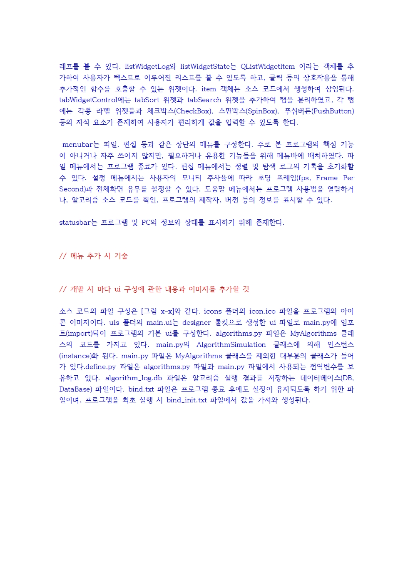
    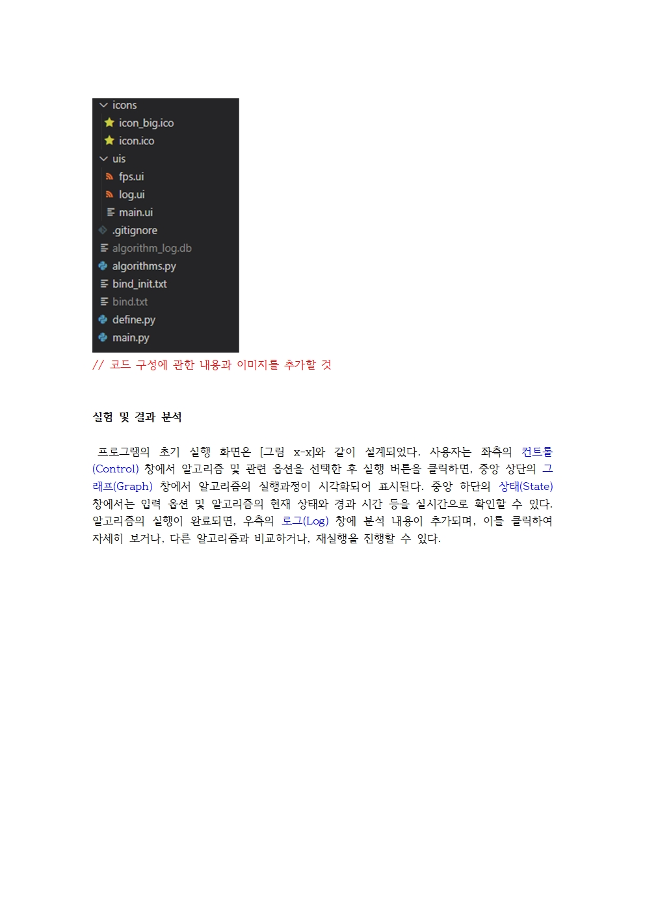
</p>

---

# 셀프 평가 및 향후 계획

* 현재:7주차, 논문 제출: 10주차<br> -> 여유기간: 약 2주

* 프로그램 핵심 기능은 모두 구현 함.
    - 8주차: 자잘한 기능 추가 예정(사용법, 프로그램 정보 표시 등)<br>프로그램은 다음주로 마무리 짓는것을 목표로 할 예정
    - 9주차: 버그 검사, 논문 작성 비중 높임

* 논문은 약 30페이지 정도 작성된 상황.
    - 8주차: 4, 5절에 비해 1, 2, 3절의 내용 부실. 내용 추가 필요.
    - 9주차: 결론 및 요약 작성, 잘못된 내용 및 논문 포맷 등 검사/수정

---

# 감사합니다.