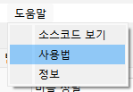
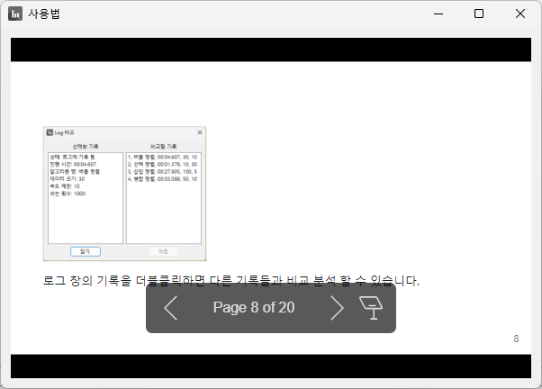
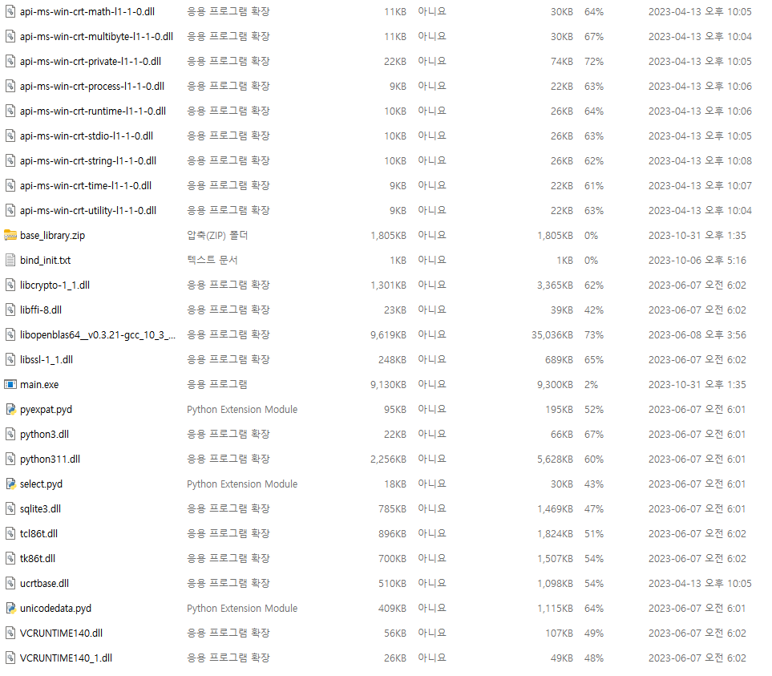
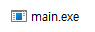

# 정렬/탐색 알고리즘 시각화 - 8주차

컴퓨터공학전공 2020215730 조대영

---

<!-- _header: 목차-->

# 목차

* ### 개발 진척사항

* ### 논문 진척사항

* ### 셀프 평가 및 향후 계획

---

<!-- _header: 개발 진척사항-->

# 개발 진척사항

* 사용법 추가

* 실행 파일 만들기(빌드 작업)

---

<!-- _header: 개발 진척사항-->

## 사용법 추가


<p align="center">
    
    
</p>

```
메뉴바의 도움말 탭에서 사용법 추가
```

---

<!-- _header: 개발 진척사항-->

## 실행 파일 만들기(빌드 작업)

<p align="center">
    
    
</p>

```
pyinstaller 라이브러리 사용. exe 파일 생성
main.exe 파일 실행 시 프로그램 실행
```

---

<!-- _header: 논문 진척사항-->

# 논문 진척사항

* [4.2. 프로그램 구현]에 추가된 UI에 대한 내용 기술

* [4.2. 프로그램 구현]에 소스 코드에 대한 내용 및 캡쳐 이미지 추가

* [5. 실험 및 결과 분석]에 추가된 기능에 대한 내용 기술

---

<!-- _header: 논문 진척사항-->

## [4.2. 프로그램 구현]에 추가된 UI에 대한 내용 기술

<p align="center">
    
    
    
</p>

```
새로 추가한 기능들의 ui에 대한 내용 추가로 기술
```

---

## [4.2. 프로그램 구현]에 소스 코드에 대한 내용 및 캡쳐 이미지 추가

<p align="center">
    
    
    
    
</p>

```
소스 코드 캡쳐 이미지 추가 및 설명 작성
```

---

## [5. 실험 및 결과 분석]에 추가된 기능에 대한 내용 기술

<p align="center">
    
    
    
    
</p>

```
새로 추가한 기능들의 이미지 추가 및 설명 작성
```

---

# 셀프 평가 및 향후 계획

* 현재:8주차, 논문 제출: 10주차<br> -> 여유기간: 약 1주

* 프로그램 핵심 기능은 모두 구현 함.
    - 9주차: 버그 검사, 교수님께 프로그램 통과 받고 마무리, 논문 작성 비중 높임

* 논문은 약 30여 페이지 정도 작성된 상황.
    - 8주차: 4, 5절에 비해 1, 2, 3절의 내용 부실. 1, 2, 3절 내용 추가.
    - 9주차: 결론 및 요약 작성, 잘못된 내용 및 논문 포맷 등 검사/수정

---

# 감사합니다.