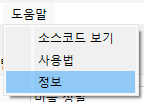
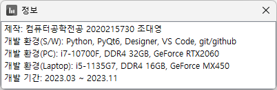
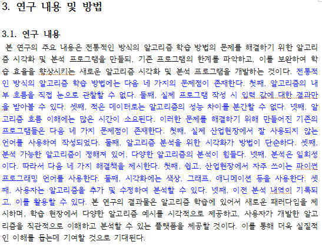
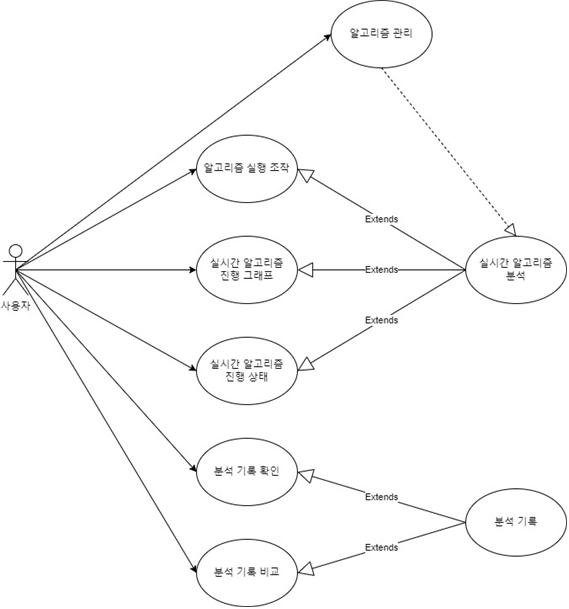
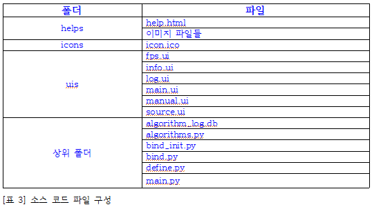
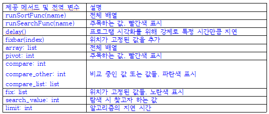
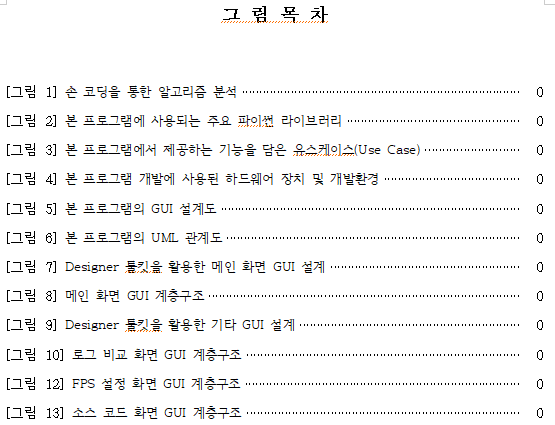
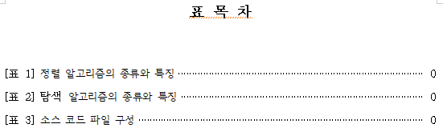

# 정렬/탐색 알고리즘 시각화 - 8주차

컴퓨터공학전공 2020215730 조대영

---

<!-- _header: 목차-->

# 목차

* ### 개발 진척사항

* ### 논문 진척사항

* ### 셀프 평가 및 향후 계획

---

<!-- _header: 개발 진척사항-->

# 개발 진척사항

* 사용법 추가

* 정보 추가

* 실행 파일 만들기(빌드 작업)

---

<!-- _header: 개발 진척사항-->

## 사용법 추가


<p align="center">
    
    
</p>

```
메뉴바의 도움말 탭에서 사용법 추가
```

---

<!-- _header: 개발 진척사항-->

## 정보 추가


<p align="center">
    
    
</p>

```
메뉴바의 정보 탭에서 프로그램 정보 등 확인
```

---

<!-- _header: 개발 진척사항-->

## 실행 파일 만들기(빌드 작업)

<p align="center">
    
    
</p>

```
pyinstaller 라이브러리를 사용하여 exe 파일 생성
main.exe 파일 실행 시 프로그램 실행
빌드 시 몇 개 경고 메시지를 보았으나, 프로그램은 정상 작동 함.
무시 가능한 수준으로 보이나, 원인 파악 가능할 시 수정 예정.
```

---

<!-- _header: 논문 진척사항-->

# 논문 진척사항

* [3.1. 연구 내용]에 추가 기술

* [3.2. 연구 방법]에 유스케이스 기술

* [4.1. 프로그램 설계]에 기재된 일부 소스코드를 표로 정리

* 그림 및 표 목차 일부 기술

---

<!-- _header: 논문 진척사항-->

## [3.1. 연구 내용]에 추가 기술

<p align="center">
    
</p>

```
기존 문제점 및 개선 사항 기술.
다음 주 연구의 필요성, 가설 설정, 연구 범위 및 한계 등 추가 기술 예정
```

---

<!-- _header: 논문 진척사항-->

## [3.2. 연구 방법]에 유스케이스 기술

<p align="center">
    
    
</p>

```
소스 코드 캡쳐 이미지 추가 및 설명 작성
```

---

<!-- _header: 논문 진척사항-->

## [4.1. 프로그램 설계]에 기재된 일부 소스코드를 표로 정리

<p align="center">
    
    
</p>

```
소스코드를 표로 수정함.
다음주 중 나머지 소스코드도 수정 예정
```

---

<!-- _header: 논문 진척사항-->

## 그림 및 표 목차 일부 기술

<p align="center">
    
    
</p>

```
그림 및 표 목차를 일부 기술하고, 그림 및 표에는 캡션을 달았음.
본문에는 더 많은 그림과 표가 있으나, 수정동안 번호의 변동이 있을 수 있어 다음주에
 나머지도 기술 예정
```

---

# 셀프 평가 및 향후 계획

* **8주차(금주) 결과**
    - 개발: 프로그램 완성, 교수님께 프로그램 리뷰 · 확인
    - 논문: 약 40페이지 가까이 작성된 상황이나, 일부 절 내용 및 포맷 상태 미흡.

* **9주차(내주) 예정**
    - 개발: 버그 검사
    - 논문: 모든 장과 절의 내용 기술, 잘못된 내용 및 논문 포맷 등 검사/수정

* **10주차 예정**
    - 논문 마무리, 최종 검토 및 논문 제출

---

# 감사합니다.