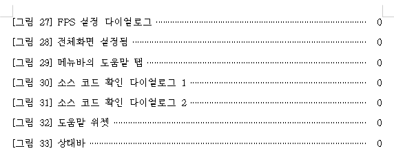
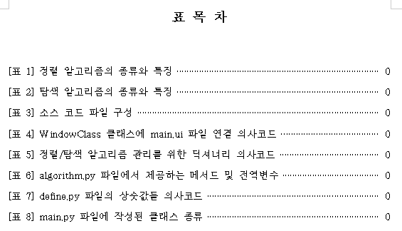
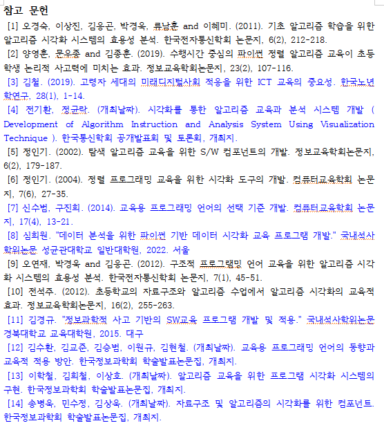
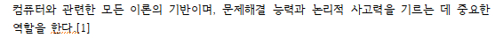
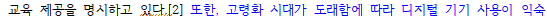

# 정렬/탐색 알고리즘 시각화 - 9주차

컴퓨터공학전공 2020215730 조대영

---

<!-- _header: 목차-->

# 목차

* ### 논문 진척사항

* ### 셀프 평가 및 향후 계획

 

###### 개발 진척은 버그 검사만 진행

---

<!-- _header: 논문 진척사항-->

# 논문 진척사항

* 추가 작성

* 그림/표 목록 작성

* 참고 문헌 추가 및 인용 번호 달기

---

<!-- _header: 논문 진척사항-->

## 추가 작성

부족한 문단, 표 등을 추가 작성하여 내용면에서는 모든 장과 절에대해 채워 넣음.
->현재 총 41페이지

**작성 내용:** 그림 목차, 표 목차, 1. 서론, 2.2. 선행연구 고찰, 3. 연구 내용 및 방법, 4.2. 프로그램 구현, 6. 결론

단, 아직 포맷이 미흡하거나, 학술적이지 못한 문장 표현, 오타 등이 존재할 수 있어 최종 제출 전까지 검사/수정이 필요함.

---

<!-- _header: 논문 진척사항-->

## 그림/표 목록 작성

    
    

논문의 모든 그림과 표에 대한 캡션 달기 및 목록 작성

---

<!-- _header: 논문 진척사항-->

## 참고 문헌 추가 및 인용 번호 달기

    

참고 문헌 14번까지 작성

---

<!-- _header: 논문 진척사항-->

    
    
    

적절한 위치에 인용 번호 추가

---

<!-- _header: 셀프 평가 및 향후 계획-->

# 셀프 평가 및 향후 계획

* **9주차(이번주) 결과**
    - **개발:** 프로그램 완성됨, 수시로 버그 검사.
    - **논문:** 현재 41페이지 작성. 포맷 상태 미흡, 어색한 표현, 오타 존재 가능.

* **10주차(다음주) 예정**
    - 논문 포맷, 어색한 표현, 오타 수정하여 마무리
    - 목차의 페이지 번호 붙이기
    - 최종 검토 및 논문 제출

---

# 감사합니다.