# 사용법

---

## 기본 화면 구성

---

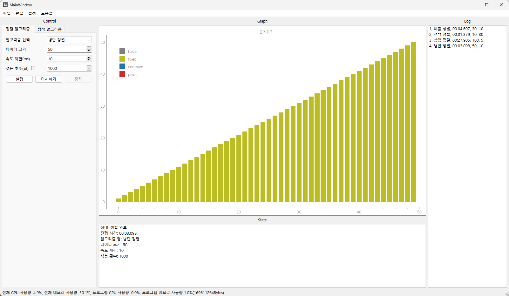

전체 화면의 구성입니다.

---

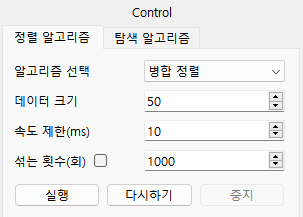

컨트롤 창입니다. 정렬 알고리즘 또는 탐색 알고리즘을 분석하기 전 여러 속성을 설정할 수 있습니다.

---

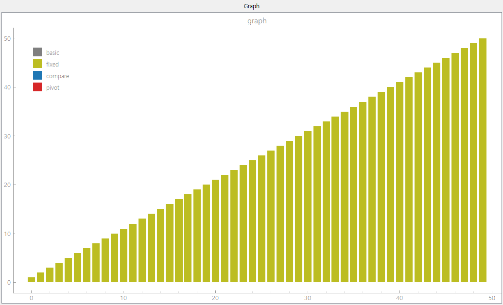

그래프 창입니다. 컨트롤 창에서 실행 버튼을 누르면 그래프 창에서 알고리즘이 시각화 되어 보여집니다.

---

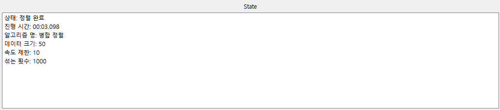

상태 창입니다. 알고리즘 시각화 또는 로그 확인 시 세부 정보가 표시됩니다.

---

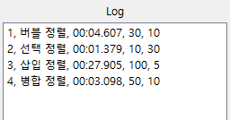

로그 창입니다. 알고리즘 분석이 완료되면 분석 기록이 저장됩니다. 기록을 선택하면 상태 창에 세부 정보가 표시됩니다.

---

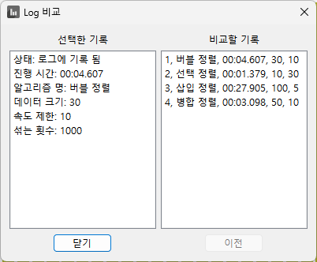

로그 창의 기록을 더블클릭하면 다른 기록들과 비교 분석 할 수 있습니다.

---

## 기타 기능

---

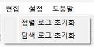

메뉴바에서는 여러가지 세부 기능을 제공합니다.

편집 메뉴에서는 분석 기록을 초기화 할 수 있습니다.

---

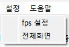

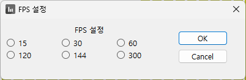

설정 메뉴에서는 사용자의 모니터 주사율에 따라 그래프의 변경 주기를 설정할 수 있습니다. 또한 전체화면을 설정 메뉴에서 적용하면 다음 실행 시에도 전체화면이 적용됩니다.

---

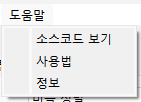

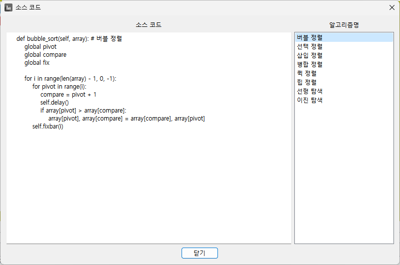

도움말 메뉴에서는 소스코드 보기를 제공합니다.


---

## 새 알고리즘 삽입

---

### 새 알고리즘 삽입은 공개된 본 프로그램의 오픈소스를 수정 및 빌드함으로서 가능합니다.
**소스코드:** https://github.com/DaeyeongCho/AlgorithmsVisualizationProject


소스 코드에서 algorithms.py 파일을 엽니다.

---

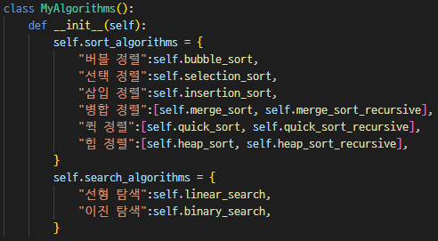

추가하고자 하는 알고리즘이 정렬 알고리즘인 경우 sort_algorithms 딕셔너리에, 탐색 알고리즘인 경우 search_algorithms 딕셔너리에 알고리즘 명과 함수명을 기입합니다. 만약 여러 함수가 사용되는 알고리즘인 경우 리스트 형식으로 알고리즘 실행 시 호출되는 함수를 0번째 인덱스에, 나머지 함수를 다른 인덱스에 기입합니다.

---

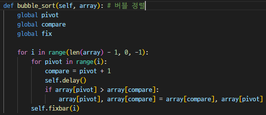

MyAlgorithms 클래스의 메서드로 알고리즘을 작성합니다.
알고리즘 작성 시 사용되는 전역 변수 및 제공 함수는 다음 장에서 확인할 수 있습니다.

---

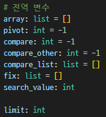

본 프로그램에서는 몇가지 전역 변수를 제공합니다. 전역 변수의 값에 따라 그래프의 모양 및 색깔이 바뀝니다.

---

**array:** 전체 배열입니다. 순서 및 값은 변경을 허용하되, 배열의 크기는 유지하는 것을 권장합니다.

**pivot:** 주목하는 값입니다. 빨간 색으로 표시됩니다.

**compare, compare_other, compare_list:** 비교 중인 값입니다. 파란색으로 표시됩니다.

**fix:** 위치가 고정된 값들입니다. 노란색으로 표시됩니다.

**search_value:** 탐색 시 찾고자 하는 값입니다. 수정하지 않는 것이 원칙입니다.

**limit:** 알고리즘의 딜레이 시간입니다. 수정하지 않는 것이 원칙입니다.

---

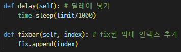

제공 함수입니다.

**delay():** 프로그램 시각화를 위해 강제로 특정 시간만큼 딜레이 합니다.
반복문 또는 다중 반복문 존재 시 가장 안쪽 반복문에 하나씩만 추가하는 것을 추천합니다.

**fixbar():** 위치가 고정된 값을 추가할 수 있는 함수입니다. fix 변수를 직접 조작해도 되지만 해당 함수를 사용해도 됩니다.

---

실행 파일로 빌드 시 다음의 파이썬 써드 파티 라이브러리(Third-party Libraries)를 요구합니다.

```
- PyQt6
- pyqtgraph
- PyQt6-WebEngine
- numpy
- pyinstaller
```

터미널에 다음 문구를 입력하여 빌드할 수 있습니다.

pyinstaller -w --add-data="helps/*;helps" --add-data="icons\*;icons" --add-data="uis/*;uis" --add-data="bind_init.txt;." --add-data="algorithms.py;." main.py
