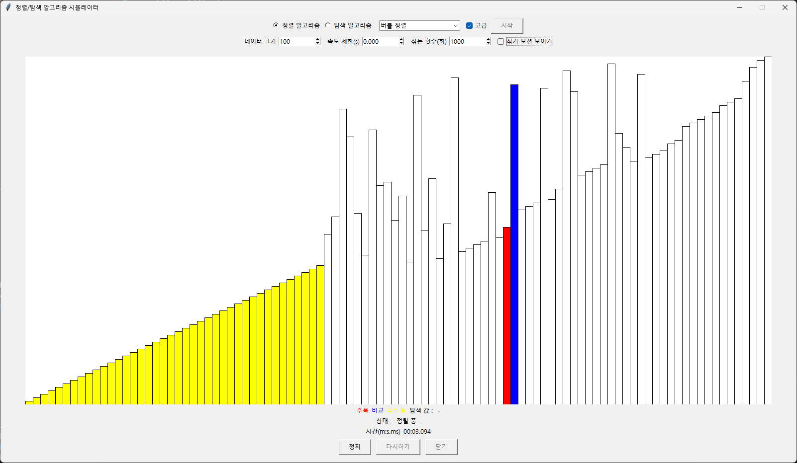
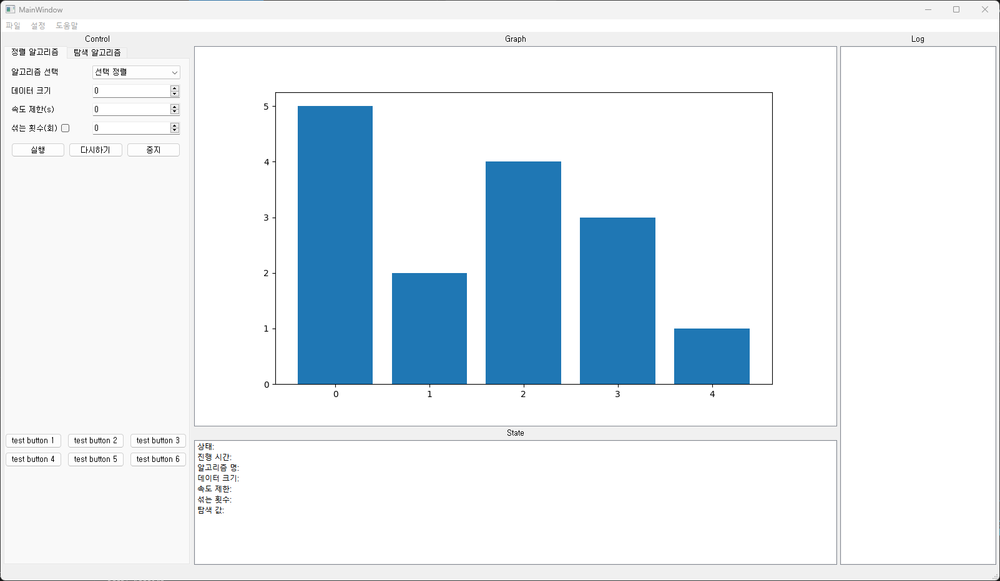
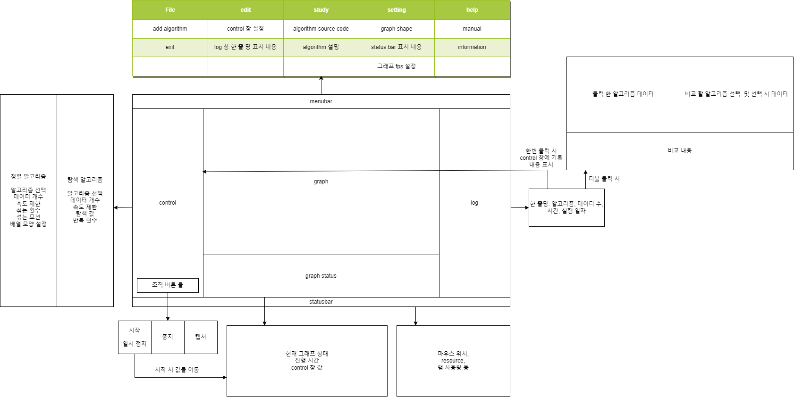
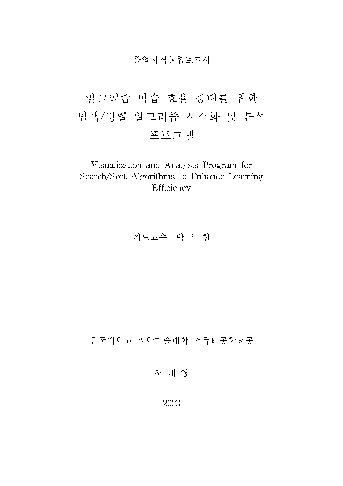
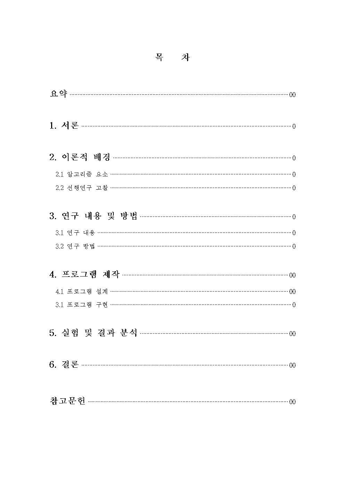
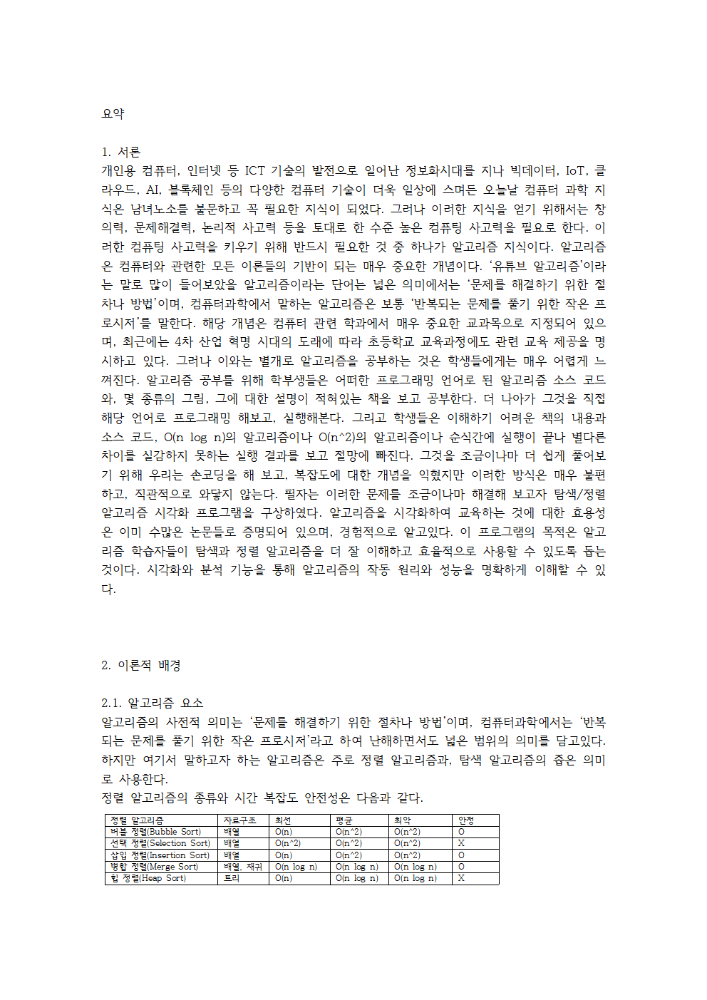
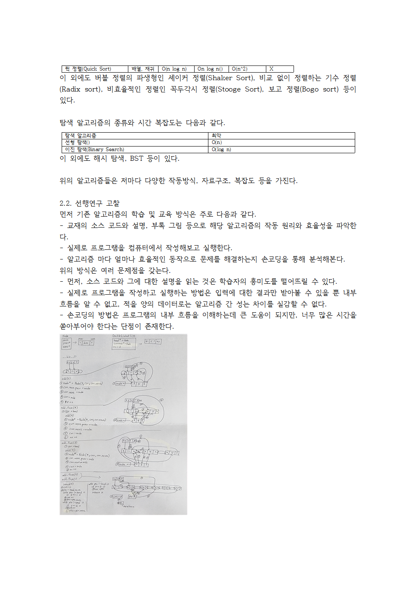
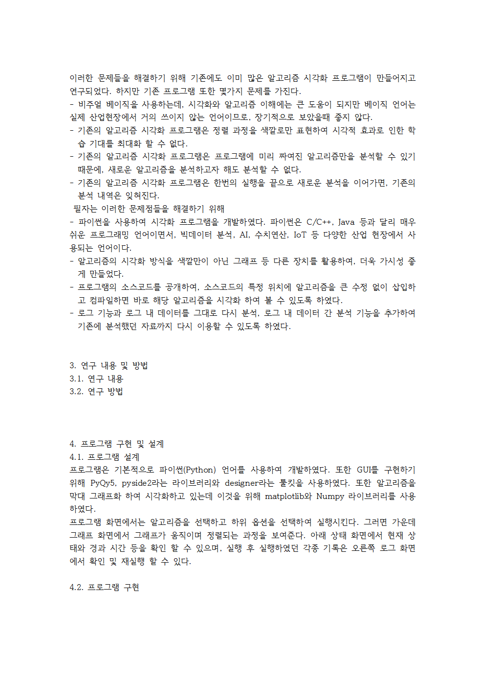
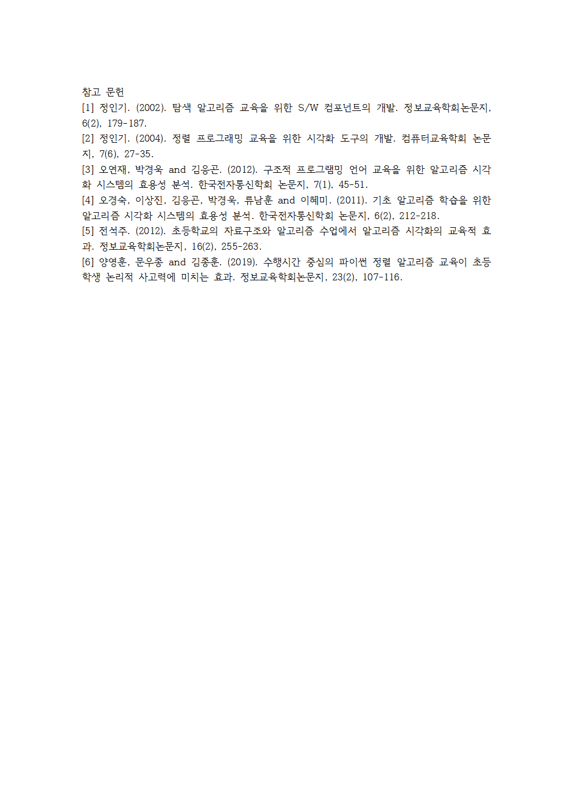

# 컴퓨터종합설계 3주차

컴퓨터공학전공 2020215730 조대영

---

<!-- _header: 목차-->

# 목차

* ### 코멘트 반영
* ### 개발 진척사항
* ### 논문 진척사항

---

<!-- _header: 코멘트 반영-->

# 코멘트 반영

## 코멘트: 프로젝트의 규모 증가 필요
프로젝트가 강의 과제 수준 - **공감, 문제 인식**

### 고려 사항

* **크로스 플랫폼** - 파이썬 모바일 제작 툴 부재, 연동 문제

* **AI 탑재, Unity 엔진 사용** - 지식 부재, 적용 가능성 저조

* **웹(인터넷) 연동** - 일부 고려, 적용 가능성 저조

* **세 문제 모두 부족한 시간과도 관련** - 짧은 시간안에 현재 보유한 기술 스택으로 상당한 프로젝트 규모 확대가 필요.

---

<!-- _header: 코멘트 반영-->

### 해결 방안

* **핵심 기능 추가/강화** - 알고리즘 시각화만 구현 할 것이 아니라 비교 분석 기능, 통계 기능, 다양한 옵션 등 많은 기능을 넣고 강화할 것.

* **디자인, UI 강화** - 디자인을 수정하고, 조잡한 UI를 개선하는 것 만으로도 더 큰 규모의 프로젝트인 것 같은 효과를 줌.

* **기존 프로그램 대비 차별화 된 기능 구현**

---

<!-- _header: 개발 진척사항-->

# 개발 진척사항

ui 틀 제작, 각종 라이브러리 연결

    
    
    

---

## 도식화

현재 구현 및 구현 예정. 이후 추가 수정 예정

    

---

<!-- _header: 개발 진척사항-->

## 중간 발표(5주차)까지의 향후 계획

* **3주차(금주):** 각종 핵심 위젯들의 기능 구현, 알고리즘 최소 1가지 이상 구현, 제공 기능 확실하게 정립

* **4주차(내주):** 나머지 알고리즘 구현, 메뉴바, 대화상자 등 구현

* 3, 4주차 계획 일정대로 소화 시 기존 목표였던 **핵심기능 개발 완료**

---

<!-- _header: 논문 진척사항-->

# 논문 진척사항

    
    
    

---

<!-- _header: 논문 진척사항-->

  
  
  

* 논문의 목차 일부 서술
* 아직은 두서 없이 쓴 글. 내포하고자 하는 핵심 내용 위주, 향후 수정 예정

---

<!-- _header: 논문 진척사항-->

## 중간 발표(5주차)까지의 향후 계획

* **3주차(금주):** 두서가 없더라도 핵심 내용을 포함하는 것을 목표로 논문의 모든 목차 내용 작성

* **4주차(내주):** 논문을 두서있게 체계적으로 정립, 중간 발표자료 작성

* 3, 4주차 계획 일정대로 소화 시 기존 목표였던 **논문 1차 작성 완료**

---

# 감사합니다.